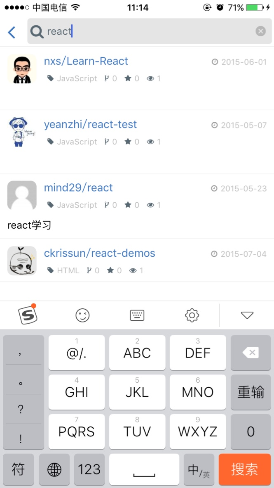
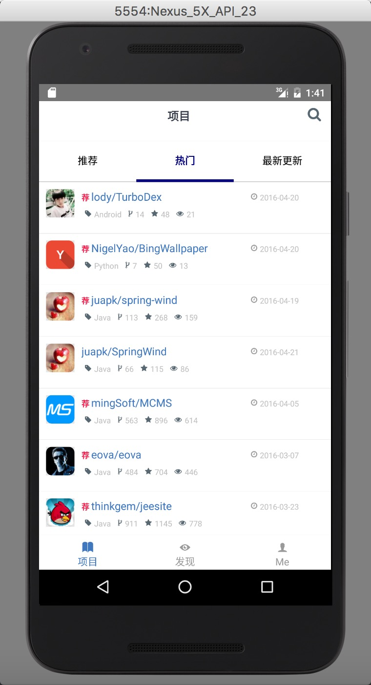
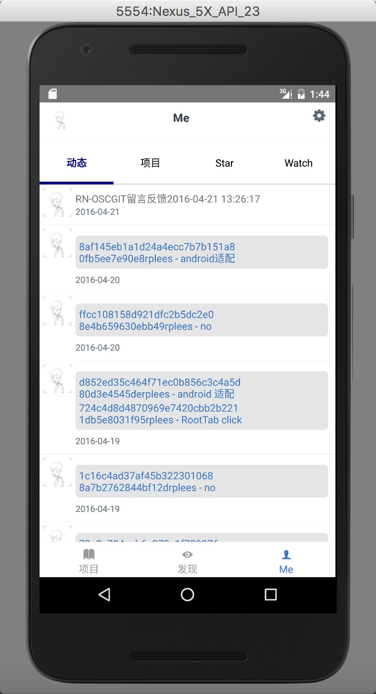
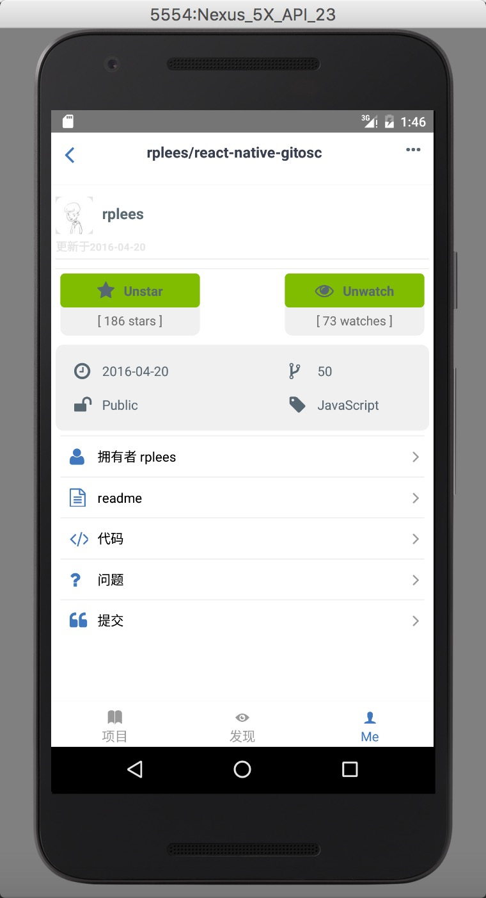
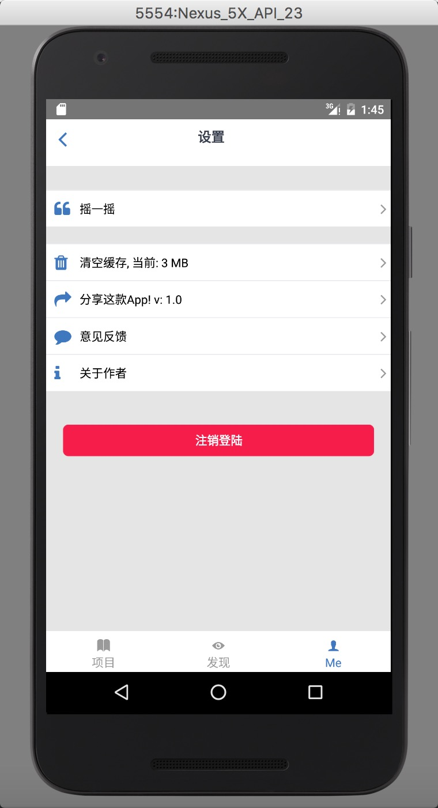

# ReactNative Git@OSC

[](https://github.com/feross/standard)

使用ReactNative仿造的Git@OSC! (感谢 [xiekw2010](https://github.com/xiekw2010/react-native-gitfeed))




**[更多截图](./screen)**

## 最近适配了Android





**[更多Android截图](./screen/android)**

**扫描下载Android(如下载不了可以打开 [发布连接](http://git.oschina.net/rplees/react-native-gitosc/releases) 下载)**


## Getting Started

### Requirements **[详细环境搭建请参考](http://rplees.com/2016/01/14/react-native%E7%8E%AF%E5%A2%83%E6%90%AD%E5%BB%BA/)**

## 使用ReactNative仿造的Git@OSC Android的功能

1. 推荐/热门/最近更新 项目浏览
2. 发现 项目浏览.
3. 用户页面(动态/项目/Star/Watch).
3. 我的资料/设置/摇一摇/留言/分享.
4. 项目的详情/Star/Watch/ 代码/README/issues及提交issue

## How to build this

###Install JS env

`npm install`

if error about 'EACCS' try

`sudo chown -R $(whoami) "$HOME/.npm"`

##iOS

open the project in ios dir `cd ios`

`pod install`

### Release mode

1. edit xcode project `OSCGit`'s scheme to `release` mode


2. bundle the JS resources, in project root dir (如果第一次运行没生存index.ios.jsbundle,再运行一次)

  ```sh
 react-native bundle --entry-file index.ios.js --bundle-output ./ios/bundle/index.ios.jsbundle --platform ios --assets-dest ./ios/bundle --dev false --sourcemap-output ./ios/bundle/source.map --verbose
  ```
3. xcode run!

### Debug mode

Edit xcode project `OSCGit` edit scheme to `debug` mode

Xcode run!

## Android
### Device
    - sh ./build_android.sh
### Emulator
    - Just run the project
### Debug mode
    - react-native run-android

## code-push热更新(可选)
### 安装
    ```bash
    cnpm install -g code-push-cli --verbose
    code-push register (会弹出网页,按照步骤安装)
    code-push access-key ls
    
    code-push app add RN_OSCGit
    code-push deployment ls RN_OSCGit
    code-push release-react RN_OSCGit ios --entryFile ./ios/bundle/index.ios.jsbundle
    
    #android 
    code-push app add RN_OSCGit_android
    code-push deployment ls RN_OSCGit_android
    code-push release-react RN_OSCGit_android android
    ```

### Check app status

	code-push deployment ls RN_OSCGit
	
	code-push deployment ls RN_OSCGit_android

### Publish update

	code-push release-react RN_OSCGit ios --entryFile ./ios/bundle/index.ios.jsbundle
	code-push release-react RN_OSCGit_android android

## Let's talk about it(So far only Chinese supported)  

[一次RN跨平台开发之旅](http://xiekw2010.github.io/2016/02/11/rngitfeed)

### License
[GPL](./LICENSE.txt). Copyright (c) [rplees](https://github.com/rplees).